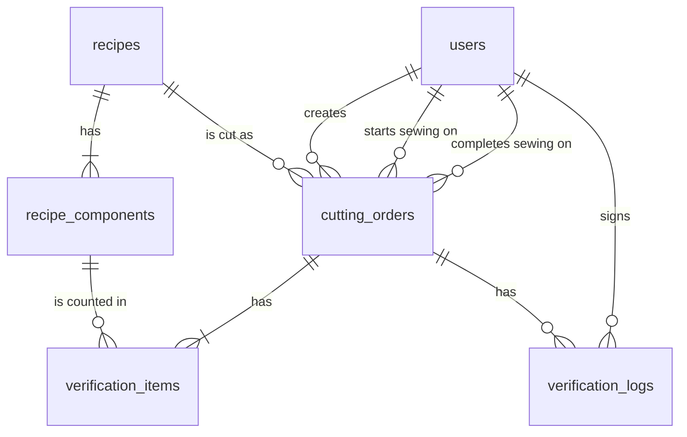

# ApparelFlow ERP — Cutting Operations & Gatekeeper Verification Terminal

A full-stack implementation of the cutting-department quality checkpoint for
ApparelFlow ERP: cutting orders are created from production recipes, verified
component by component, and released to the Sewing Queue only after an
authorized verifier signs off.

**Live demo:** <https://apparelflow-erp-fawn.vercel.app> (sign in with any of
the [demo credentials](#demo-credentials) below).

> **Status:** all three workspaces are built: the Cutting Supervisor's order
> engine, the Verification Terminal with its hard stop, and the Sewing Queue.

## Tech stack

| Layer     | Choice                               |
| --------- | ------------------------------------ |
| Framework | Next.js 16 (App Router) + React 19   |
| Language  | TypeScript (strict)                  |
| Styling   | Tailwind CSS 4                       |
| Linting   | ESLint 9 with `eslint-config-next`   |
| Database  | PostgreSQL (Neon) via Drizzle ORM    |
| Auth      | bcrypt password hashes, signed JWT session cookie (`jose`) |
| Tests     | Vitest against in-memory Postgres (PGlite) |

## Architecture

- **One Next.js application** serves the pages and the JSON API. Pages are
  Server Components that read through the same service functions the API
  uses; every change goes through an API route handler.
- **Three layers.** `src/lib` holds rules shared by the browser and the
  server (state machine, multiplier, traffic lights, validation).
  `src/server` holds session handling, role guards and one service per
  workspace. `src/app` holds the pages and thin route handlers.
- **Each rule is enforced on the server and again in the database.** Route
  handlers check the role and the input, services check the order's status
  inside a transaction, and constraints and triggers refuse anything that
  slips past. See [The gatekeeper hard stop](#the-gatekeeper-hard-stop) and
  [Database schema](#database-schema).

An order moves through `CUTTING_IN_PROGRESS` → `PENDING_VERIFICATION` →
`VERIFIED`, or back through `REJECTED` to `PENDING_VERIFICATION`. `VERIFIED`
is final and is the only status the Sewing Queue shows.

## Getting started

Requires Node.js 22 or later and a PostgreSQL database (Neon).

```bash
npm install
cp .env.example .env.local   # then set DATABASE_URL and SESSION_SECRET
npm run db:migrate           # create the tables
npm run db:seed              # recipes and demo users
npm run dev
```

Open <http://localhost:3000>.

| Variable         | Purpose                                                  |
| ---------------- | -------------------------------------------------------- |
| `DATABASE_URL`   | Neon pooled connection string                            |
| `SESSION_SECRET` | Signs the session cookie; at least 32 characters (`openssl rand -base64 32`) |

Both must also be set in the hosting provider's environment settings.

## Demo credentials

The sign-in page shows these with a one-click button for each, and the header
has a Role Switcher that signs in as the chosen role.

| Role               | Email                         | Password         |
| ------------------ | ----------------------------- | ---------------- |
| Cutting Supervisor | `supervisor@apparelflow.demo` | `Supervisor@123` |
| Cutting Verifier   | `verifier@apparelflow.demo`   | `Verifier@123`   |
| Sewing Supervisor  | `sewing@apparelflow.demo`     | `Sewing@123`     |

## How access control works

- Signing in checks the bcrypt hash and sets an `httpOnly`, `SameSite=Lax`
  cookie holding a JWT signed with `SESSION_SECRET` (8 hour expiry).
- Every API route calls `requireRole(request, ...)` first. No session returns
  `401`; a session with the wrong role returns `403`.
- The acting user and role always come from the verified cookie. Fields such
  as `createdBy`, `status` or `orderNo` in a request body are ignored.
- Page redirects and hidden buttons are convenience only. The API guards and
  database constraints are the security boundary.

## API

All bodies are JSON. Errors have the shape
`{ "error": { "code", "message", "fieldErrors?" } }`.

| Method & path                 | Role               | Result |
| ----------------------------- | ------------------ | ------ |
| `POST /api/auth/login`        | public             | Sets the session cookie. `401` on bad credentials |
| `POST /api/auth/logout`       | any                | Clears the session cookie |
| `GET /api/auth/me`            | signed in          | Current user |
| `GET /api/recipes`            | cutting_supervisor | Recipes with components |
| `GET /api/orders`             | cutting_supervisor | All cutting orders |
| `POST /api/orders`            | cutting_supervisor | Creates an order in `CUTTING_IN_PROGRESS`. `422` with field errors on invalid input |
| `PUT /api/orders/:id`         | cutting_supervisor | Corrects an order (same body as create). `CUTTING_IN_PROGRESS`: all fields. `REJECTED`: fabric roll and fabric used only. `409` once pending or verified |
| `DELETE /api/orders/:id`      | cutting_supervisor | Deletes an order that was never submitted (`CUTTING_IN_PROGRESS`). `409` otherwise |
| `POST /api/orders/:id/submit` | cutting_supervisor | Moves `CUTTING_IN_PROGRESS` or `REJECTED` to `PENDING_VERIFICATION`. `409` from any other status |
| `GET /api/verification/orders` | cutting_verifier  | Orders in `PENDING_VERIFICATION` only |
| `GET /api/verification/history` | cutting_verifier  | Counts of pending batches and of the signed-in verifier's own approvals and rejections, plus their most recent approvals and rejections (up to 25 of each) |
| `PUT /api/verification/orders/:id/counts` | cutting_verifier | Saves counts as `{ "counts": [{ "componentId", "actualQty" }] }`. The server derives each traffic light |
| `POST /api/verification/orders/:id/approve` | cutting_verifier | Moves the order to `VERIFIED` and writes the audit log. `422` if any component is RED, missing or uncounted |
| `POST /api/verification/orders/:id/reject` | cutting_verifier | Body `{ "note" }`. Moves the order to `REJECTED`. `422` without a note |
| `GET /api/sewing/queue`       | sewing_supervisor  | `VERIFIED` batches only, with piece counts, verifier sign-off, stored wastage % and earlier rejection notes |
| `POST /api/sewing/queue/:id/start` | sewing_supervisor | Records "Start Sewing Assembly" (who and when). `409` if already started; `404` for any order that is not `VERIFIED` |
| `POST /api/sewing/queue/:id/complete` | sewing_supervisor | Records that sewing is finished (who and when). `409` if not started or already completed; `404` for any order that is not `VERIFIED` |

Any other role calling a verification or sewing endpoint gets `403`.

Creating an order derives the expected piece count for every recipe component
(target quantity x pieces per garment) on the server and stores them as
`verification_items` in the same transaction.

## The gatekeeper hard stop

| Status | Rule              | Effect                                  |
| ------ | ----------------- | --------------------------------------- |
| GREEN  | actual = expected | Passes                                  |
| YELLOW | actual > expected | Surplus recorded; the batch may proceed |
| RED    | actual < expected | Shortage; approval is blocked           |

The rule is enforced in three places, each independent of the one before it:

1. **UI:** "Approve Batch" is disabled while any component is RED, uncounted
   or invalid.
2. **API:** approval reads the counts stored in the database inside a
   transaction that locks the order, ignores the request body, and returns
   `422` listing the blocking components. It also compares the checklist with
   the recipe: a component that is missing from the checklist, or listed with
   a quantity the recipe does not require, blocks approval exactly as a
   shortage does. The verifier id comes from the session and the timestamp
   from the database.
3. **Database triggers** (`drizzle/0001_gatekeeper_triggers.sql` and
   `drizzle/0004_signoff_integrity.sql`), which hold even for a query that
   bypasses the API:
   - an order cannot become `VERIFIED` while a component is uncounted or short;
   - an order cannot become `VERIFIED` unless its counted checklist matches
     the recipe exactly: every recipe component present, each with the
     quantity the batch size requires, and nothing else on it;
   - the checklist is fixed once the order is submitted: components cannot be
     added or removed, and an expected quantity can never be edited;
   - an order cannot become `VERIFIED` or `REJECTED` unless the matching
     sign-off row is inserted into `verification_logs` in the same
     transaction, so the audit trail cannot be bypassed;
   - status changes must follow the state machine, and new orders must start
     as `CUTTING_IN_PROGRESS`;
   - `verification_logs` is append-only (no update, delete or truncate);
   - the counts and batch data of a `VERIFIED` order cannot be changed or
     deleted.

On approval the verifier id, timestamp and wastage % are written to
`verification_logs`; the component count variances are the frozen
`verification_items` rows. The sign-off row and the status change are written
in one transaction, and the database refuses either one without the other.

## Sewing Queue isolation

- The queue query has `WHERE status = 'VERIFIED'` written into it
  (`listSewingQueue` in `src/server/sewing/service.ts`). The function takes no
  filter argument and the route passes nothing from the request, so URL
  parameters cannot widen it.
- Starting sewing on an order that is not `VERIFIED` returns the same `404`
  as an order that does not exist, so the sewing floor learns nothing about
  unverified work.
- "Start Sewing Assembly" is stored as `sewing_started_at` and
  `sewing_started_by` on the order rather than as a fifth status. The order
  stays `VERIFIED`, the state machine keeps its four states, and the queue
  rule stays literally `status = 'VERIFIED'`. The database only accepts a
  start on a `VERIFIED` order and makes the start record permanent
  (`drizzle/0002_sewing_handoff.sql`).
- Finishing a batch is recorded the same way, as `sewing_completed_at` and
  `sewing_completed_by`. The database refuses a completion on a batch that
  was never started and makes the completion record permanent
  (`drizzle/0003_sewing_completion.sql`). The Sewing workspace groups the
  verified batches into In Queue, In Sewing and Completed from these fields.

## Database schema

PostgreSQL on Neon, defined in `src/server/db/schema.ts` with Drizzle ORM and
applied by the SQL migrations in `drizzle/`.



Every table has `id integer` as an auto-generated identity primary key; it is
omitted from the tables below.

### Enum types

| Type                    | Values                                                             |
| ----------------------- | ------------------------------------------------------------------ |
| `user_role`             | `cutting_supervisor`, `cutting_verifier`, `sewing_supervisor`      |
| `order_status`          | `CUTTING_IN_PROGRESS`, `PENDING_VERIFICATION`, `REJECTED`, `VERIFIED` |
| `item_status`           | `GREEN`, `YELLOW`, `RED`                                           |
| `verification_decision` | `APPROVED`, `REJECTED`                                             |

### `users`

| Column          | Type          | Rules                     |
| --------------- | ------------- | ------------------------- |
| `email`         | `text`        | required, unique          |
| `password_hash` | `text`        | required; bcrypt hash     |
| `role`          | `user_role`   | required                  |
| `full_name`     | `text`        | required                  |
| `created_at`    | `timestamptz` | required, default `now()` |

Has many cutting orders (as creator) and verification logs (as verifier).

### `recipes`

| Column             | Type           | Rules                         |
| ------------------ | -------------- | ----------------------------- |
| `recipe_code`      | `text`         | required, unique              |
| `name`             | `text`         | required                      |
| `category`         | `text`         | required                      |
| `std_fabric_yards` | `numeric(6,2)` | required, greater than 0      |
| `wastage_cap`      | `numeric(5,2)` | required, 0 or more (percent) |

Has many components and cutting orders. Seeded with `REC-BL01` Casual Blouse
(1.8 yd, 5% cap) and `REC-CT02` Crop Top (1.1 yd, 8% cap).

### `recipe_components`

| Column               | Type      | Rules                                        |
| -------------------- | --------- | -------------------------------------------- |
| `recipe_id`          | `integer` | required; references `recipes`, cascade delete |
| `component_name`     | `text`    | required; unique within a recipe             |
| `pieces_per_garment` | `integer` | required, greater than 0                     |
| `image_url`          | `text`    | optional                                     |

Belongs to a recipe. Five components are seeded for each recipe.

### `cutting_orders`

| Column              | Type            | Rules                                          |
| ------------------- | --------------- | ---------------------------------------------- |
| `order_no`          | `text`          | required, unique; `CO-` plus the padded id     |
| `recipe_id`         | `integer`       | required; references `recipes`                 |
| `target_qty`        | `integer`       | required, greater than 0                       |
| `fabric_roll_id`    | `text`          | required                                       |
| `actual_fabric_yds` | `numeric(10,2)` | required, greater than 0                       |
| `status`            | `order_status`  | required, default `CUTTING_IN_PROGRESS`; indexed |
| `created_by`        | `integer`       | required; references `users`                   |
| `created_at`        | `timestamptz`   | required, default `now()`                      |
| `updated_at`        | `timestamptz`   | required, default `now()`                      |
| `sewing_started_at` | `timestamptz`   | optional; only allowed when status is `VERIFIED` |
| `sewing_started_by` | `integer`       | optional; references `users`; set together with `sewing_started_at` |
| `sewing_completed_at` | `timestamptz` | optional; only allowed after `sewing_started_at`, and not earlier than it |
| `sewing_completed_by` | `integer`     | optional; references `users`; set together with `sewing_completed_at` |

Belongs to a recipe and a user; has many verification items and logs.
Trigger `cutting_orders_guard` enforces the state machine and freezes a
`VERIFIED` order; `cutting_orders_sewing_start_is_permanent` and
`cutting_orders_sewing_completion_is_permanent` make the sewing start and
completion records unchangeable.

### `verification_items`

One row per recipe component per order, created with the order.

| Column         | Type          | Rules                                             |
| -------------- | ------------- | ------------------------------------------------- |
| `order_id`     | `integer`     | required; references `cutting_orders`, cascade delete |
| `component_id` | `integer`     | required; references `recipe_components`; unique within an order |
| `expected_qty` | `integer`     | required, greater than 0; target quantity x pieces per garment |
| `actual_qty`   | `integer`     | `NULL` until counted; 0 or more                   |
| `status`       | `item_status` | `NULL` until counted                              |

A check constraint keeps `status` consistent with the counts: both `NULL`, or
`GREEN` when equal, `YELLOW` when actual is higher, `RED` when lower. Trigger
`verification_items_guard` freezes the rows of a `VERIFIED` order. It also
fixes the checklist itself: rows can only be added or removed while the order
is `CUTTING_IN_PROGRESS`, and `expected_qty` can never be edited, so only the
verifier's count changes after submission.

### `verification_logs`

The audit trail: one row per approve or reject decision.

| Column           | Type                    | Rules                                   |
| ---------------- | ----------------------- | --------------------------------------- |
| `order_id`       | `integer`               | required; references `cutting_orders`; indexed |
| `verifier_id`    | `integer`               | required; references `users`            |
| `decision`       | `verification_decision` | required                                |
| `rejection_note` | `text`                  | required and non-blank when the decision is `REJECTED` |
| `wastage_pct`    | `numeric(7,2)`          | required; computed on the server        |
| `timestamp`      | `timestamptz`           | required; always set to the database clock |

An order can have many rejections but, through a partial unique index, at
most one approval. The table is append-only: triggers refuse `UPDATE`,
`DELETE` and `TRUNCATE`.

Every row is a sign-off, and triggers (`drizzle/0004_signoff_integrity.sql`)
tie it to the status change it records:

- a row is only accepted when `verifier_id` is a user whose role is
  `cutting_verifier` and the order is `PENDING_VERIFICATION`;
- `timestamp` is overwritten with the database clock, so a decision cannot be
  backdated;
- when the transaction commits, the order must have moved to the status the
  decision says (`APPROVED` to `VERIFIED`, `REJECTED` to `REJECTED`), so a
  sign-off cannot be left on an order that never moved;
- in the other direction, an order cannot move to `VERIFIED` or `REJECTED`
  without a matching sign-off row from the same transaction.

### Migrations

| File                                   | Contents                                              |
| -------------------------------------- | ----------------------------------------------------- |
| `drizzle/0000_initial_schema.sql`      | The six tables, enums, constraints and indexes        |
| `drizzle/0001_gatekeeper_triggers.sql` | Append-only audit log, state machine and hard-stop triggers |
| `drizzle/0002_sewing_handoff.sql`      | Sewing start columns, their constraints and trigger   |
| `drizzle/0003_sewing_completion.sql`   | Sewing completion columns, their constraints and trigger |
| `drizzle/0004_signoff_integrity.sql`   | Checklist-matches-recipe and signed-decision triggers |

## Scripts

| Command             | Purpose                          |
| ------------------- | -------------------------------- |
| `npm run dev`       | Start the development server     |
| `npm run build`     | Create a production build        |
| `npm start`         | Serve the production build       |
| `npm run lint`      | Run ESLint                       |
| `npm run typecheck` | Type-check without emitting files |
| `npm test`          | Run the automated tests           |
| `npm run db:generate` | Generate a SQL migration from the schema |
| `npm run db:migrate`  | Apply pending migrations to `DATABASE_URL` |
| `npm run db:seed`     | Seed recipes and demo users (idempotent) |

## Project structure

```
src/
  app/              Next.js App Router
    api/            Route handlers (auth, recipes, orders)
    login/          Sign-in page and demo credential panel
    (app)/          Signed-in shell with the Role Switcher
      cutting/      Cutting Supervisor: order list, create/edit dialog, delete
      verification/ Cutting Verifier: count entry, approve and reject
      sewing/       Sewing Supervisor: verified batches, start sewing
  components/       Shared client components and control styles
  lib/              Rules shared by browser and server: roles, order state
                    machine, multiplier and wastage maths, traffic-light
                    rules, input validation
  server/           Server-only code
    auth/           Session tokens, login, API and page guards
    orders/         Order service (create, edit, delete, list, submit)
    verification/   Counts, approval hard stop and rejection
    sewing/         Sewing Queue query and start of sewing
    db/             Drizzle schema, Neon client, migrate and seed scripts
    http.ts         Error type and route wrapper for consistent API errors
tests/              Vitest suites and the in-memory test database
drizzle/            SQL migrations (schema, gatekeeper triggers, sewing handoff, sign-off integrity)
```
